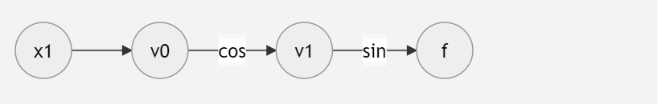

# Milestone 1

## Introduction
Differentiation is an important operation in scientific research broadly
applied in non-linear optimization problems and numerical solution of
differential equations. Recently, the development of machine learning
techniques including artificial neural networks also require large amount of
gradient computation. For complex functions whose analytical derivative
expressions are difficult to obtain, one traditional option to calculate its
derivative is finite-difference method, but may have issues such as
floating point errors. Automatic differentiation (AD) refers to a general way
of computing the derivatives of functions expressed as computation graphs, with
which the evaluation of derivatives could reach machine precision. Our `autodiff`
package provides tools to calculate the derivative of any function with an
analytic expression based on the AD technique. 

## Background

AD mainly makes use of two properties of closed-form functions: 
1. Any closed-form function is a combination (sum, product, quotient or compound) of
elementary functions, and the analytical expressions of the derivatives of
elementary functions are already-known.
2. Derivative rules including sum rule, product rule, quotient rule and most importantly, the chain rule.  
- sum rule: (f+g)' = f'+g'
- product rule: (f*g)' = f'g+g'f*g
- quotient rule: (f/g)' = (f'g-g'f)/(g×g)
- chain rule: h = f(g(•)), then h' = f'(g(•))× g'(•)

To evaluate the value of a complicated function expression, we need to start with
independent variables and evaluate a series of intermediate results and finally
reach the final result. The idea of AD is to use a computational graph to
represent the function where each node represents an intermediate variable and
only elementary operations are carried out between intermediate variables. Because we
utilize the operation rules of derivatives mentioned above, the derivative at any 
node in the computation graph can only rely on its parent node(s). As a result, we 
obtain the final derivative result by computing derivatives and repeatedly utilizing 
derivative rules following the flow of the computation graph. 

Here we give a brief example to illustrate how we calculate derivatives 
based on compution graph. If we want to evaluate the derivative with respect 
to x1 at x1=pi/2 for function f=sin(cos(x1)), here is our computation graph



Then we follow the graph and evaluate step by step:
|step| trace | Elementary function |Current value | Elementary function derivative| $\nabla_x$ value|
|--|--|--|--|-- |--|
|1|v0|x|pi/2|$\dot x$|1|
|2|v1|cos(v0)|0|$-sin(v_0)\dot v_0$|0|
|3|f|sin(v1)|0|$cos(v_1)\dot v_1$|0|

Note that when we calculate "elementary function derivative", we made use of the chain rule. 


## "How to" Section:

### How to Install 
Our package, named `autodiff-aabj` (to avoid name conflicts), is distributed via the Python Package
Index (PyPI). More information about our package can be found directly on its PyPI page:
https://pypi.org/project/autodiff-aabj/.

Assuming you have pip installed, run
```sh
pip install autodiff-aabj
```

Finally, finish by importing dualnumber and it's operators:

```py
  import numpy as np
  from autodiff.dualnumber import Dualnumber
  from autodiff.operatorsfunc import sin, cos, tan, exp, log
```

Now you are ready to use our autodifferentiation package!

### How to Use
```py
## EXAMPLE 1:
# set dual number 'x'
# first value (np.pi) is the real part at which we want to calculate the derivative and value of the function
# second value '1' is the dual part. In this case it is set to one, and will default to 1, but there is an option to change it. 
x = Dualnumber(np.pi, der=1)

# Next implement your function, by substituting in the defined dual number:
f = (tan(x)) - 2 ** x * exp(x)

# The forward pass has now been executed and we can check the value of the function and it's derivative:
# value of the function: 
print(f.val) # should equal approx -204.2160993
# value of the derivative:
print(f.der) # should equal approx -344.76791290283


## EXAMPLE 2:
# Here is a second example, executed similarly to the first except with the initial dual part not equal to 1

# set the dual number, with dual = pi/4
x = Dualnumber(np.pi / 4, der=np.pi / 4)

# forward pass:
f = tan(x) + x

# check value:
print(f.val)

# The true derivative of a function for a dual number where the dual part is not equal to one, must be divided by the initial dual part. 
# i.e. f.der/x.der = true derivative at x.val
# Check derivative:
print(f.der) # should equal approx: 3 * x.der or 3 * pi/4, where 3 is the actual derivative at x.val=np.pi/4

# Check value
print(f.val) # should be equal to np.pi / 4 + 1

```
## Software Organization

### Directory Structure
Our code will live in a separate folder called `src`. We will have a separate
directory, `test`, for our tests. Finally, while not necessarily code, our
documentation will live in a directory named `docs`, which will go into
technical detail how each user-facing function is used, and any examples if
appropriate.

### Modules

We will have one package, named `autodiff`. Within this module there may be a
few modules, with the most core functionality in a module named `grad`.  This
module will provide us with the basic functionality of being able to
differentiate on a defined set of elementary operations.  To help define the
scope of our project, we will determine ahead of time which elementary
functions can be used to integrate with our library. In order to accomplish
this, we will create a second module, `primitives`, which houses some of the
elementary operations we define in the implementation section, as well as the 
symbol class.

### Test Suite

Our test suite will live in a separate directory called `tests`. We will use
TravisCI to run continuous integration, and make sure we do not accidentally
introduce regressions in our code when we change or add functionality. CodeCov
will be used to ensure that any new code that we write is properly tested and
accounted for.

### Documentation
We will use Sphinx as our documentation generator. To build sphinx, you can run the command inside
the `docs/` directory:
```
sphinx-build source/ build/
```

The generated HTML files are viewable as `cs107-FinalProject/docs/build/index.html`.
    
### Distribution 
We will use PyPI to distribute our package.   
We will use a library called `twine` to help us package and distribute our
package over PyPI. We will follow this helpful tutorial
https://packaging.python.org/tutorials/packaging-projects/, provides a detailed
guide on how to setup the software structure. Using a framework may be helpful,
but in an effort to reduce software overhead and maximize learning for each
step, we will elect to forgo a framework.

## Implementation 
We will have a few core data structures:
* Computational graph
* Custom classes for instantiating dual
numbers and performing forward and backward passes.

### Computational Graph
The computational graph will consist of node and edge data structures. 
The graph is bidirectional since we plan to implement both the backward pass and forward pass 
implementations.
The nodes will store data in tuples.

### Symbol Class 
The symbol class is a user-facing data structure which represents 
an abstraction of a variable. It will use dual numbers under the hood
that run on the computational graph.

### Dual Number Class 
We will begin by constructing a dualNumber() class that
deals with the properties of dual numbers. It will take a real value and dual
value as the initial input. The dualNumber class will have the following
algebraic operations, along with their reverse counterparts (not shown). 

```py
class Dualnumber:
    def __init__(self, a, der=1):
        self.val = a
        self.der = der

    def set_dual(self, dual):
        self.der = dual

    def __add__(self, other):

    def __mul__(self, other):

    def __sub__(self, other):

    def __truediv__(self, other):

    def __pow__(self, other):

    def __neg__(self, other):
    
    def __pos__(self, other):
    
    def __eq__(self, other):
```

### Primitives
We will have a module that is dedicated to housing elementary operations. 
We will maintain an updated list of these operations:
1. `sin`
2. `cos`
3. `pow`
4. `exp`
5. `log`

### Forward Pass 
The exact details of the forward pass algorithm are currently abstracted,
but we desire to implement a forward mode function which can take in a function,
and utilize dual numbers and computational graph
to compute the resulting value and respective gradients.

### Reverse Pass
The exact details of the reverse pass algorithm are currently abstracted,
but we desire to implement a reverse mode function which will implement
the backpropagation step, utilizing the saved results from our forward pass.

## Future Features
Our future features include the following:
* Fine-tuning our forward pass to include a computational graph
* Adding additional functions like the inverse of sinusoidal functions, and other operations
* Utilizing the computational graph to execute a backward pass
* Creating more advanced documentation through Sphinx 
* Releasing the package on PyPi for installation through pip
* Expand our testing suite to accomodate additional features

We expect the most difficult part of our future features to be constructing the computational graph. We expect to accomplish this through ordered dictionaries, where we will add lines of code to each defined function, so when they are called upon we can access the operations and numbers in order. We will then use the operations and numbers to contruct the nodes and edges of a computational graph, which will subsequently be used fto perform the backward pass. 


